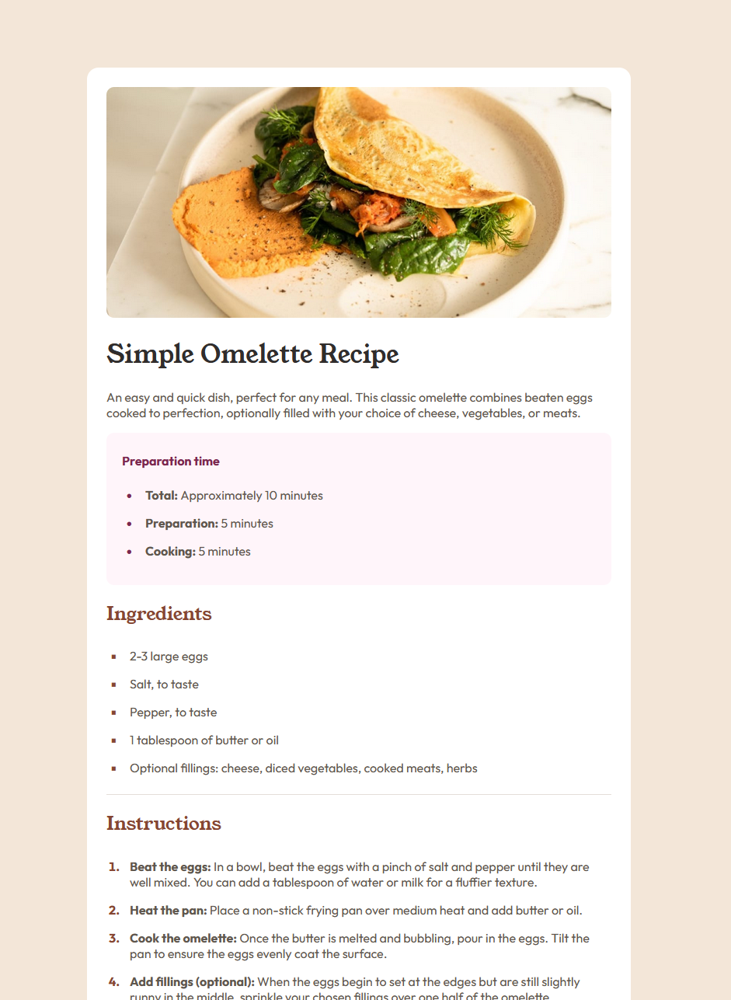

# Tarif Sayfası - Frontend Mentor Pratik Rehberi

Bu rehber, Frontend Mentor tarif sayfası projesinde karşılaşabileceğiniz yaygın sorunları ve çözümleri içerir.

## Proje Önizlemesi



**Canlı Demo:** [https://recipepagepratik.vercel.app/](https://recipepagepratik.vercel.app/)

## Önemli CSS İpuçları

### 1. Nested CSS Kullanımı

Modern CSS ve CSS preprocessor'lar (Sass, Less) nested (iç içe) yazım stilini destekler:

```css
.prep {
    background-color: hsl(330, 100%, 98%);
    border-radius: 10px;
    padding: 10px 20px;
    
    h3 {
        color: hsl(332, 51%, 32%);
    }
    
    ul li::marker {
        color: hsl(332, 51%, 32%);
    }
}
```

### 2. Responsive Görüntü Yönetimi

Mobil görünümde resmin container dışına taşması için:

```css
@media (max-width: 768px) {
    body {
        padding: 0px;
    }
    
    main {
        border-radius: 0;
    }
    
    main img {
        border-radius: 0px;
        margin: -25px;
        width: calc(100% + 50px);
    }
}
```

Burada dikkat edilmesi gereken nokta, `calc()` fonksiyonunda operatörlerin etrafında boşluk bırakılmasıdır.

### 3. Liste Stillerini Özelleştirme

```css
/* Kare liste işaretleri */
.ingredients ul li {
    list-style-type: square;
}

/* Numaralı liste işaretlerini kalınlaştırma */
.instructions ol li::marker {
    font-weight: bold;
}
```

### 4. Tablo Stillerini Düzenleme

```css
table {
    width: 100%;
    border-collapse: collapse;
    
    th {
        text-align: left;
        font-weight: normal;
        padding-left: 40px;
    }
    
    td {
        padding: 10px 40px;
        text-align: left;
        font-weight: bold;
        color: hsl(14, 45%, 36%);
    }
    
    tr {
        border-bottom: 1px solid hsl(30, 18%, 87%);
    }
}
```

`border-collapse: collapse;` bitişik hücre kenarlıklarını birleştirerek daha profesyonel bir görünüm sağlar.

## Tarayıcı Uyumluluğu

- Nested CSS sözdizimi tüm tarayıcılarda doğrudan desteklenmeyebilir
- `::marker` sözde elementi yeni bir CSS özelliğidir ve eski tarayıcılarda tam desteklenmeyebilir
- Responsive tasarımınızı farklı tarayıcılarda test edin

## Proje Geliştirme İpuçları

1. HTML yapısını semantik etiketlerle oluşturun
2. Renk değişkenlerini tutarlı şekilde kullanın
3. Mobil öncelikli tasarım yaklaşımı benimseyin
4. Görsel hiyerarşiyi tipografi ve boşluklarla destekleyin

---

Bu rehber, Frontend Mentor tarif sayfası projenizi geliştirmenize yardımcı olması için hazırlanmıştır. İyi çalışmalar!